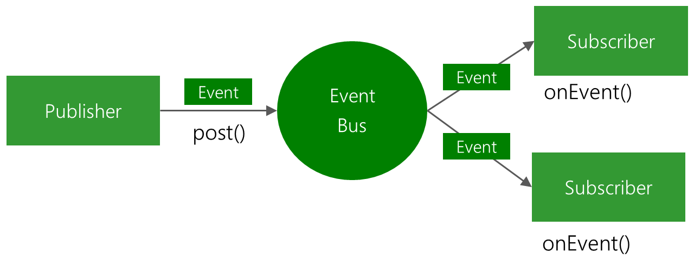

EventBus
========
EventBus is publish/subscribe event bus optimized for Android.<br/>


EventBus...

 * simplifies the communication between components
    * decouples event senders and receivers
    * performs well with Activities, Fragments, and background threads
    * avoids complex and error-prone dependencies and life cycle issues
 * makes your code simpler
 * is fast
 * is tiny (~50k jar)
 * is proven in practice by apps with 100,000,000+ installs
 * has advanced features like delivery threads, subscriber priorities, etc.

 [](https://travis-ci.org/greenrobot/EventBus)

EventBus in 4 steps
-------------------
1. Define events:<br/>
<code>public class MessageEvent { /* Additional fields if needed */ }</code><br/><br/>
2. Register your subscriber (in your onCreate or in a constructor):<br/>
<code>eventBus.register(this);</code><br/><br/>
3. Declare your subscribing method<br/>
<code>@Subscribe</code><br/>
<code>public void onEvent(AnyEventType event) {/* Do something */};</code><br/><br/>
4. Post events:<br/>
<code>eventBus.post(event);</code>

Add EventBus to your project
----------------------------
EventBus is available on Maven Central. Please ensure that you are using the latest version by [checking here](http://search.maven.org/#search%7Cga%7C1%7Cg%3A%22org.greenrobot%22%20AND%20a%3A%22eventbus%22)

Gradle:
```
    compile 'org.greenrobot:eventbus:3.0.0'
```

Maven:
```
<dependency>
    <groupId>org.greenrobot</groupId>
    <artifactId>eventbus</artifactId>
    <version>3.0.0</version>
</dependency>
```

[Or download EventBus from Maven Central](http://search.maven.org/#search%7Cga%7C1%7Cg%3A%22de.greenrobot%22%20AND%20a%3A%22eventbus%22)

How-to, Developer Documentation
-------------------------------
Details on EventBus and its API are available in the [HOWTO document](HOWTO.md).

Additional Features and Notes
-----------------------------
Link: [Features](http://greenrobot.org/eventbus/features/)

* **Based on annotations:** Event handling methods can be named however you want, and only need to be annotated with **@Subscribe**.
* **Performance optimized:** It's probably the fastest event bus for Android.
* **Convenience singleton:** You can get a process wide event bus instance by calling EventBus.getDefault(). You can still call new EventBus() to create any number of local busses.
* **Subscriber and event inheritance:** Event handler methods may be defined in super classes, and events are posted to handlers of the event's super classes including any implemented interfaces. For example, subscriber may register to events of the type Object to receive all events posted on the event bus.

Links
-----
[CHANGELOG](http://greenrobot.org/eventbus/changelog/)

[FAQ](http://greenrobot.org/eventbus/documentation/faq/)

How does EventBus compare to other solutions, like Otto from Square? Check this [comparison](COMPARISON.md).

License
-------
Copyright (C) 2012-2016 Markus Junginger, greenrobot (http://greenrobot.org)

EventBus binaries and source code can be used according to the [Apache License, Version 2.0](LICENSE).

More Open Source by greenrobot
==============================
[__greenrobot-common__](https://github.com/greenrobot/greenrobot-common) is a set of utility classes and hash functions for Android & Java projects.

[__greenDAO__](https://github.com/greenrobot/greenDAO) is an ORM optimized for Android: it maps database tables to Java objects and uses code generation for optimal speed.

[Follow us on Google+](https://plus.google.com/b/114381455741141514652/+GreenrobotDe/posts) to stay up to date.